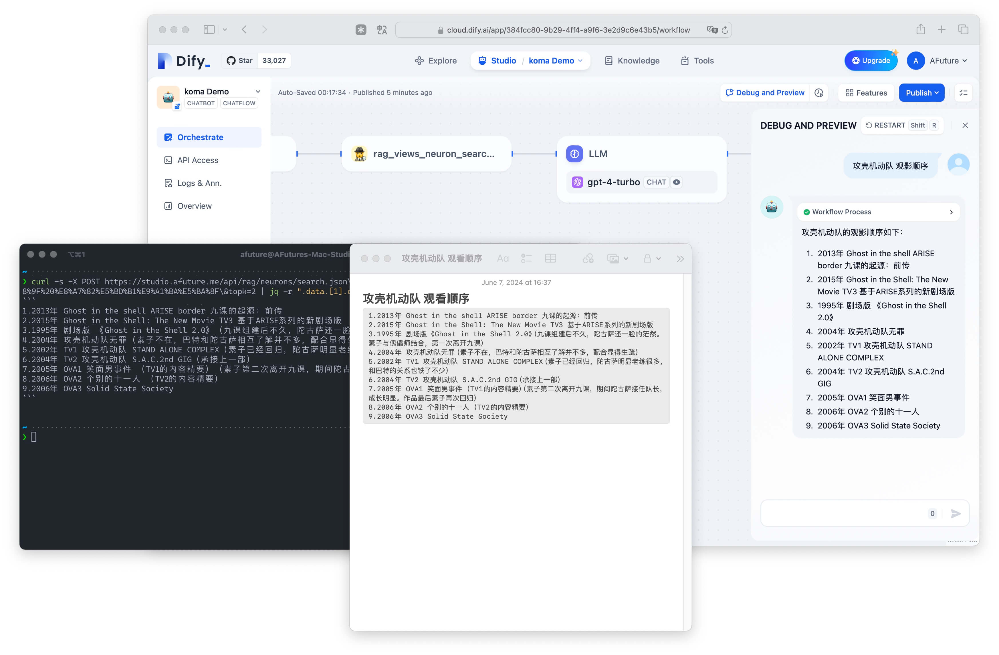

# koma



## Overview

> [!IMPORTANT]
> Notice: This project is still in development.

This project(`koma`) is designed to help users search for information on macOS.

Specifically thanks to the [apple_cloud_notes_parser](https://github.com/threeplanetssoftware/apple_cloud_notes_parser) and [neon](https://neon.tech).


## Feature

- [x] [core] List all notes from Notes.app;
- [x] [core] Convert all notes into markdown;
- [ ] [core] Get a specific note;
- [ ] [core] Create a note using AppleScript;
- [x] [api ] Incremental index all notes and its paragraphs;
- [x] [api ] Semantic query in both json and plain text;
- [ ] [api ] Summrize similar content;
- [ ] [api ] Automatic sync Apple notes.

## Usage 

### As a data connector in RAG platform.

By using OpenAPI this is easy to intergate into any rag platform, such as [Dify](https://dify.ai).

In Dify, goto [Tools](https://cloud.dify.ai/tools?category=api) and create one using `<Your Domain>/api/openapi.json`.

Goto [Home koma](https://afuture.notion.site/koma-6b6891fabc524f9884748731b586dda0) see step by step guide.

### Raycast

TODO.

## Install

### Docker Compose

<details>

#### Step 0: Prepare 

1. You have [Docker](https://docs.docker.com/desktop/install/mac-install/) or [Orbstack](https://orbstack.dev)(recommand) installed.
2. Your Docker have [Full Disk Access](https://www.perplexity.ai/search/How-to-enable-mOAW4vpVRlmeMvtg6EjnNw) permission.
3. Your Apple Notes.app folder is `~/Library/Group Containers/group.com.apple.notes`

#### Step 1: Download this project

```
> git clone https://github.com/AFutureD/koma.git
```

#### Step 2: Configure the `.env`

See Section [Configuration](#configuration).

#### Step 3: Run server

```
> docker-compose up -d
```

</details>

### Local

<details>

#### Step 0: Prepare

1. You have [pdm](https://pdm-project.org/en/stable/) and [uvicorn](https://www.uvicorn.org) installed.
2. Your Terminal have [Full Disk Access](https://www.perplexity.ai/search/How-to-enable-mOAW4vpVRlmeMvtg6EjnNw) permission.
3. Your Apple Notes.app folder is `~/Library/Group Containers/group.com.apple.notes`
4. Configure the `.env`

#### Step 1: Download this project

```
> git clone https://github.com/AFutureD/koma.git
```

#### Step 2: Install dependencies.

```
> cd koma
> pdm install
```

#### Step 3: Configure the `.env`

See Section [Configuration](#configuration).

#### Step 4: Run server

```
> pdm run setup
> pdm run server
```

</details>

## Configuration

### Basic

<details>

| Key                | Description                                                                                | Default               | Required | Example                     |
| :----------------- | :----------------------------------------------------------------------------------------- | :-------------------- | :------: | :-------------------------- |
| SERVER_URL         | The Server Url used in [OpenAPI](https://spec.openapis.org/oas/latest.html#fixed-fields-3) | http://localhost:8000 |  False   | https://example.com         |
| PGHOST             | The host of PostgreSQL                                                                     | -                     |   True   | *.neon.tech                 |
| PGUSER             | The user of PostgreSQL                                                                     | -                     |   True   | db_name                     |
| PGPASSWORD         | The password of PostgreSQL                                                                 | -                     |   True   | user_name                   |
| PGDATABASE         | The db name of PostgreSQL                                                                  | -                     |   True   | password                    |
| APPLE_NOTES_FOLDER | Used when deployed in a docker                                                             | -                     |  False   | /root/group.com.apple.notes |

</details>

### Third API Keys

<details>

| Key            | Description                                        | Default | Required | Example             |
| :------------- | :------------------------------------------------- | :------ | :------: | :------------------ |
| OPENAI_API_KEY | The api key of OpenAI used for generate embeddings | -       |   True   | sk-xxxxxxxxxxxxxxxx |
| CO_API_KEY     | The api key of Cohere used for rerank              | -       |   True   | cxxx9Sxx4jWxxOWxxxp |

</details>

